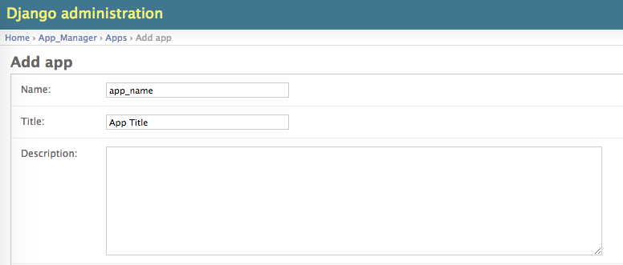

#For Developers
 
**Cartoview Provides an [Appstore][1] for GIS Developers.**

#Develope your own App

- Create a new empty app from cartoview app template as follow in your cartoview project directory

```
python manage.py startapp --template=https://github.com/cartologic/cartoview-app-template/archive/master.zip simple_app apps/
```

- Edit cartoview_project/apps/apps.yml and add entry for your app

```
- name: app_name
  active: true
  order: 0
```

- Add the app to the database form django admin interface

	


[1]: http://www.cartoview.org