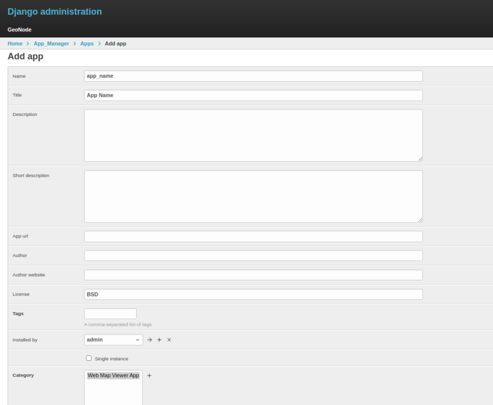
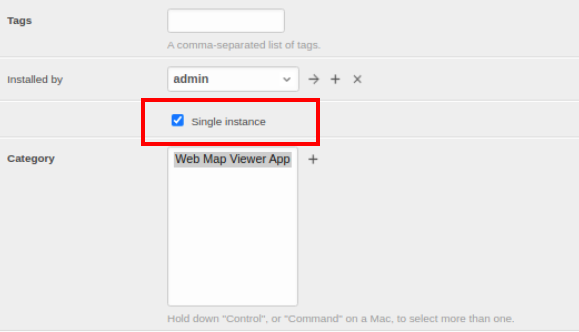
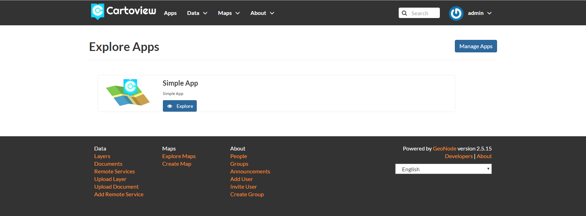

# For Developers

Cartoview Provides [GeoApp Market][1] for GIS Developers.

[1]: http://www.cartoview.org/

- **Create your own app**

***

Create a new empty App from Cartoview App template as below in your Cartoview project directory.

```shell
cd apps
django-admin.py startapp --template=https://github.com/cartologic/Cartoview-app-template/archive/master.zip <your_App_name>
```

Edit ``cartoview_project/apps/apps.yml`` and add entry for your app or create ``apps.yml`` file. If you can't find it, add the following lines:

```shell
- name: <app_name>
  active: true
  order: 0
```

Add stores using the following command inside Cartoview project directory.

```shell
python manage.py loaddata app_stores.json
```

Add the new App to the database form at Django admin interface.




!!! note
    Don't forget to check Single instance option if you want to test it for the first time.
    
Now open Cartoview, navigate to ``Apps``, your app should be there.



Click ``Explore`` button to open the app home page.


Congratulations, now you have created your first app on Cartoview. You can upload it to Cartoview App market to make use of the features provided by this market.
