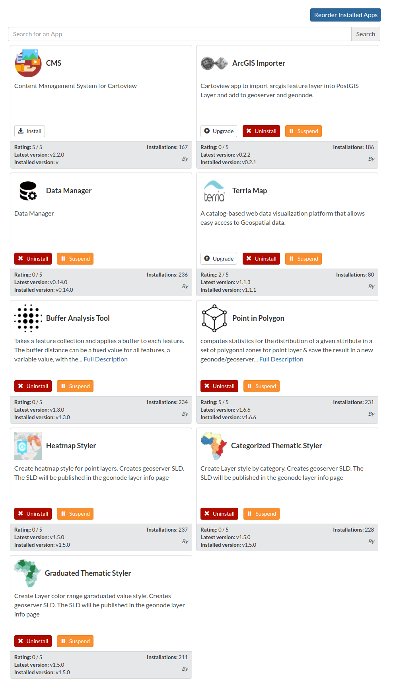

# Install App

!!! note
    These steps works ONLY if Cartoview is up and running.

To install apps from [GeoApp Market](https://appstore.cartoview.net/):

Go to ``Apps`` tab, click ``Manage Apps`` button, and install the app you want.
    

