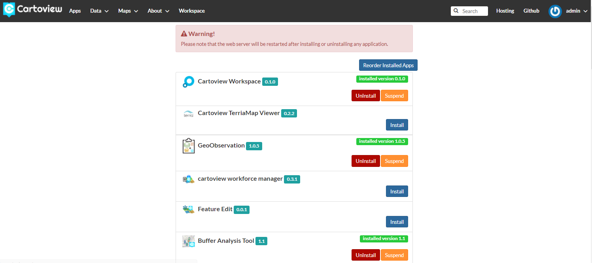

# Install App

!!! note
    These steps works only if Cartoview is up and running.

- **Install apps from GeoAppMarket**

***

To install apps from [GeoApp Market][1]:

&nbsp;&nbsp;&nbsp;&nbsp;Go to ``Apps`` tab, click ``Manage Apps`` button, and install the app you want.

[1]: https://cartoview.net/