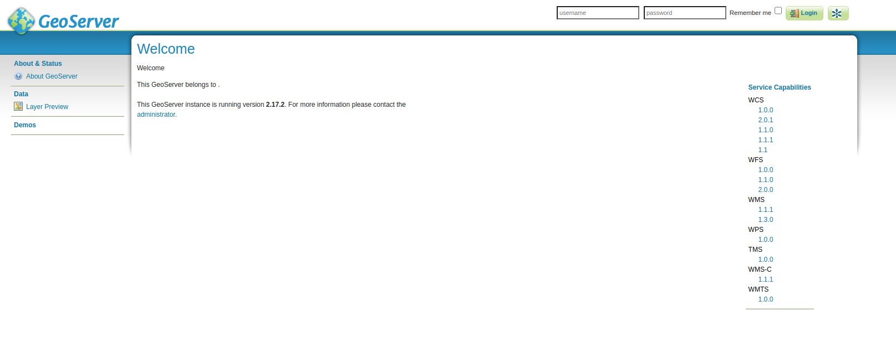

# Cartoview Installation | Docker

## Introduction
This guide describes how to install and configure a fresh setup of Cartoview to run it in Production mode using Docker on [**Ubuntu 20.04**](#for-ubuntu-2004) or [**Windows 10**](#for-windows-10).

This part of the documentation describes installation of **Cartoview-1.31.0** which comes with **GeoNode-3.1** and **GeoServer-2.17.2**.

---

## Installation Requirements

### For Ubuntu 20.04:

#### Install Docker

In order to be able to run Cartoview with docker engine, Docker Compose should be installed, but because it relies on Docker Engine, we will install``docker`` first from [Docker official website](https://docs.docker.com/get-docker/).

Install **Docker Engine**, follow [this guide](https://docs.docker.com/engine/install/ubuntu/). We recommend installing it using [docker repository](https://docs.docker.com/engine/install/ubuntu/#install-using-the-repository).

Install **Docker Compose**, follow [this guide](https://docs.docker.com/compose/install/).

!!! note
    The Docker daemon needs to use root privileges, so we must prefix each docker command with ``sudo``, but if you want to run them without ``sudo``, check [How to manage Docker as a non-root user](https://docs.docker.com/engine/install/linux-postinstall/#manage-docker-as-a-non-root-user).

Check if Docker is installed successfully.
```shell
docker --version
# Docker version 20.10.10, build b485636

docker-compose --version
# docker-compose version 1.29.2, build 5becea4c
```

### For Windows 10:

#### Install Docker Desktop
Docker Desktop is an easy-to-install application for your Mac or Windows environment that enables you to build and share containerized applications and 
microservices. Docker Desktop includes [Docker Engine](https://docs.docker.com/engine/), Docker CLI client, [Docker Compose](https://docs.docker.com/compose/), and many useful tools.

Walk through this guide to download and install [Docker Desktop](https://docs.docker.com/desktop/windows/install/#install-docker-desktop-on-windows).

Proceed with installation and leave everything as default.

Docker Desktop does not start automatically after installation. 
To start Docker Desktop, Search for **Docker**, and select **Docker Desktop** in the search results.

When you see the Docker menu (A whale icon) in the taskbar stays steady, **Docker Desktop** is up-and-running, and is accessible from any terminal window.

!!! note
    If you right-click on the whale icon, you can check multiple features like docker version, docker hub, dashboard, etc.
    
    
    
**Docker Dashboard** provides a useful interface to handle and control all the available containers easily. Please visit [Docker Desktop Dashboard](https://docs.docker.com/desktop/dashboard/) for more details.

**Optional | Configure Docker Resources**

You may want to change the default resources given to Docker to speed up operations that will be done on the containers.

Right-click on the whale icon, select **Settings**, navigate to **Resources** tab and change the resources as you wish.


---

## Cartoview Installation

### Running Cartoview Docker Services
Download **cartoview-1.31.0** by cloning the repository and using the tag **v1.31.0**.

```shell
git clone -b v1.31.0 https://github.com/cartologic/cartoview.git
```

This will create a directory called ``cartoview``. Navigate inside it to install Cartoview using docker.
    
```shell
cd cartoview
docker-compose up -d
```

!!! note
    `-d` is used to start up the containers daemonized, which means they will be started in the background (and keep running if you log out from the server or close the shell). `docker-compose` will take care to restart the containers if necessary (e.g. after boot).

!!! warning
    For **Ubuntu**, if you didn't configure docker to run without ``sudo``, make sure to prefix each docker command with it.
    
Get a cup of coffee and wait until all the images are pulled and installed successfully.

!!! warning
    While installing using **Windows Docker Desktop**, you may be prompted to accept whether to give permission for Docker to mount its containers on one of your hard-drives or to not. Accept this so that the containers can run properly.
    
    If you didn't accept, you will get errors. Execute ``docker-compose up -d`` again and accept.
    
After all images are downloaded, you can monitor the logs of initiating Cartoview with this command.

```shell
# This will show the logs of each service in the docker-compose.yml
docker-compose logs -f --tail=100

# Show logs only for cartoview service
docker-compose logs -f --tail=100 cartoview
```

**For Windows Docker Desktop**

If you open **Docker Dashboard**, you should find the installed containers up and running.


Also, you can see the logs by just ``double-click`` on ``cartoview``.


### Migrate & Load default data
We need to execute post-installation commands to make `cartoview` work properly after it's up and running. So we will open a terminal inside this service to execute these commands.

If you have [Make](https://www.gnu.org/software/make/) installed on your machine, you can just use the Makefile available at cartoview directory.
```shell
# This will go through the Makefile and execute the command called "run"
make run
```

!!! note
    The command `make run` will execute a chain of commands that are required to make things work properly. You can check these commands in the `Makefile` available inside cartoview directory.


If you have used the previous command then you can skip the following ones.

#### For Ubuntu:
```shell
docker-compose exec cartoview bash
```

#### For Windows:
Open **Docker Dashboard** and for ``cartoview_cartoview_1`` container, click on the Cli button to open the terminal in which we will execute the below commands.


This will open a shell inside the container in which we will execute the following commands.

Detect changes in the ``app_manager``.
```shell
python manage.py makemigrations app_manager
```

Migrate the data.
```shell
python manage.py makemigrations
python manage.py migrate
```

Create accounts table.
```shell
python manage.py migrate account
```

Load default User.
```shell
python manage.py loaddata sample_admin.json
```

Load default oauth apps so that you will be able to authenticate with defined external server.
```shell
python manage.py loaddata default_oauth_apps_docker.json
```

Load default Cartoview Appstore data.
```shell
python manage.py loaddata app_stores.json
```

Load default Initial Data for Cartoview.
```shell
python manage.py loaddata initial_data.json
```

!!! note
    After executing the above commands, you can ``exit`` the container terminal by just typing exit then hit the ``Enter`` button.
    
Restart Cartoview services running on docker so that the changes takes effect.

```shell
docker-compose restart
```

#### Test Development Server
Check if Cartoview is working as expected.

In the browser, navigate to [http://10.5.0.4/](http://10.5.0.4/).
!!! note
    Cartoview is running on **10.5.0.4** according to a pre-configured [external IP](https://github.com/cartologic/cartoview/blob/v1.31.0/docker-compose.yml#L111).

**For Windows:**

Open Docker Dashboard and for ``cartoview_nginx_1``container, click on ``Open in browser`` button to open Cartoview in the browser.


You should get:


You should be able to successfully log with the default admin user (admin / admin) and start using it right away.

Open GeoServer available at [http://10.5.0.4/geoserver/](http://10.5.0.4/geoserver)


Make sure you're logged in with **admin/admin** in Cartoview at [http://10.5.0.4/](http://10.5.0.4/) then navigate to [http://10.5.0.4/geoserver/](http://10.5.0.4/geoserver/) and click on the 
GeoNode button to use the pre-configured authentication between GeoNode and GeoServer.


!!! note
    You can also log in with the default GeoServer credentials admin/geoserver, but using GeoNode button is easier and quicker.

---

## GeoServer Configuration

### Optional | Change default password

Login with GeoServer credentials that were mentioned above.

At the left-side menu, navigate to **Security** section and click on **Users, Groups, Rules**.


Click on **Users/Groups** then select **admin**.


Set the password you wish then scroll to the end of the page and click **Save**.


    
Now, you can log out and login again with the new password you have just entered.

---

## Post-Installation Notes

Congratulations! Cartoview is now installed successfully.

You can upload layers, create maps, and install Cartoview apps to visualize these maps.

Once Cartoview is installed, You can navigate to [http://10.5.0.4/apps/](http://10.5.0.4/apps/) to check and install all available apps from the [App Store](https://appstore.cartoview.net/).

After installing any app, you may need to restart cartoview docker services in order to install the app properly.
```shell
docker-compose restart
```

Collect static files using the command:
```shell
docker-compose exec cartoview python manage.py collectstatic --noinput
```

Or you can use the [Make](https://www.gnu.org/software/make/) tool to run pre-configured `collectstatic` command.
```shell
# This will go through the Makefile and execute the command called "collect_static"
make collect_static
```
