# Cartoview Installation | Docker

## Introduction
This document describes the installation of Cartoview using Docker on either [Ubuntu 18.04](#for-ubuntu-1804) or [Windows 10](#for-windows-10).

## Installation Requirements

#### For Ubuntu 18.04:

- **Install Docker**

***

In order to be able to run Cartoview with docker engine, Docker Compose should be installed, but because it relies on Docker Engine, we will install ``docker`` first from [Docker official website][1].

1. Install **Docker Engine**, navigate to [this guide][2]. We recommend to install it using [docker repository][3].

2. Install **Docker Compose**, navigate to [this guide][4].

[1]: https://docs.docker.com/get-docker/
[2]: https://docs.docker.com/engine/install/ubuntu/
[3]: https://docs.docker.com/engine/install/ubuntu/#install-using-the-repository
[4]: https://docs.docker.com/compose/install/

!!! note
    The Docker daemon needs to use root privileges, so we must prefix each docker command with ``sudo``, but if you want to run them without ``sudo``, check [How to manage Docker as a non-root user][5].
    
[5]: https://docs.docker.com/engine/install/linux-postinstall/#manage-docker-as-a-non-root-user

**Validate Docker Installation**

To make sure Docker is installed successfully, run the following command.
```shell
docker --version
# Docker version 19.03.8, build afacb8b
docker-compose --version
# docker-compose version 1.25.4, build 8d51620a
```

- **Install Python2.7 and Django**

***

In order to run Cartoview, we need to install python and django.

```shell
sudo apt-get update
sudo apt-get install python-django
```

#### For Windows 10:

- **Install Docker**

***

Docker has two applications, you can use one of them:

&nbsp;&nbsp;&nbsp;&nbsp;1. **[Docker Desktop](#using-docker-desktop)** but it has [specific system requirements][6] that must be met.

[6]: https://docs.docker.com/docker-for-windows/install/#system-requirements

&nbsp;&nbsp;&nbsp;&nbsp;2. **[Docker Toolbox](#using-docker-toolbox)** which is used for systems that do not meet the requirements of Docker Desktop.

###### Using Docker Desktop:

Walk through this guide to download and install [Docker Desktop][7].

[7]: https://docs.docker.com/docker-for-windows/install/

!!! warning
    Before installing Docker Desktop, please read carefully the [What to know before you install][8] section.
    
[8]: https://docs.docker.com/docker-for-windows/install/#what-to-know-before-you-install

Proceed with installation and leave everything as default.

After installing docker desktop, we need to start it. In the search-bar, search for **Docker**, and select **Docker Desktop** in the search results.

When the whale icon in the taskbar stays steady, **Docker Desktop** is up-and-running, and is accessible from any terminal window.

!!! note
    If you right-click on the whale icon, you can check multiple features like docker version, docker hub, dashboard, etc.
    
    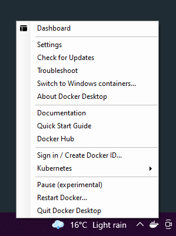
    
**Docker Dashboard** provides a useful interface to handle and control all the available containers easily. Please visit [Docker Desktop Dashboard][9] for more details.

[9]: https://docs.docker.com/docker-for-windows/dashboard/

***
**Optional | Configure Docker Resources**

You may want to change the default resources given to Docker to speed up operations that will be done on the containers.

Right-click on the whale icon, select **Settings**, navigate to **Resources** tab and change the resources as you wish.

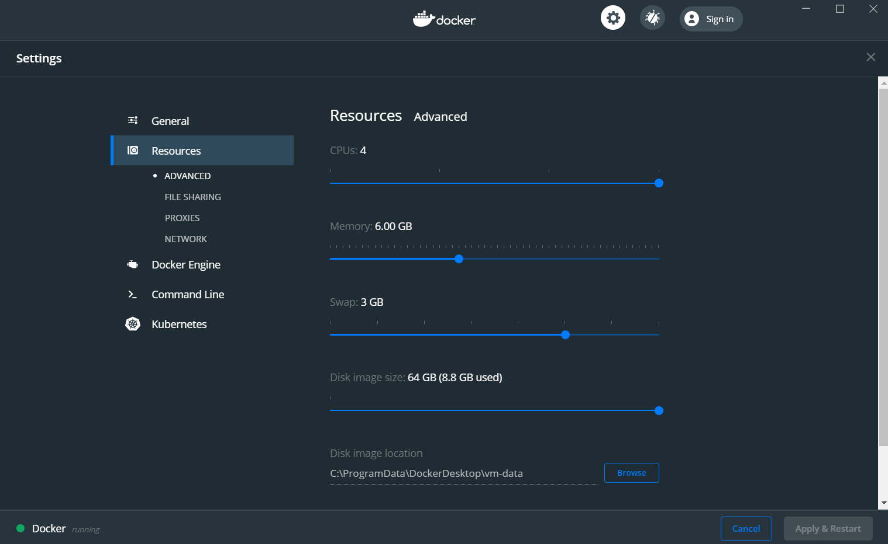
***

###### Using Docker Toolbox:

Walk through this guide to download and install [Docker Toolbox][10] untill you got the terminal in which we will execute the following commands.

[10]: https://docs.docker.com/toolbox/toolbox_install_windows/

!!! note
    **Docker Toolbox** by default, is configured to use IP address ``192.168.99.100`` so instead of using ``localhost`` we will use this IP address.
    

After installing one of the docker applications above, Validate Docker Installation by opening ``Windows PowerShell`` and execute the following command:

**Validate Docker Installation**

After installing one of the docker applications above, validate docker installation by checking its version.

At any directory, ``right-click with left-Shift`` on the free space and select ``Open Windows PowerShell here``.

This will open a terminal in which we will execute all the upcoming commands. Just copy-paste the commands and hit the Enter button.

```shell
docker --version
# Docker version 19.03.8, build afacb8b
docker-compose --version
# docker-compose version 1.25.4, build 8d51620a
```

The version should be something like what is after the ``#`` symbol.

- **Install Python2.7 and Django**

***

As explained in [Cartoview Installation | Windows](/installation/windows/#installation-requirements) section, download and install [Python2.7][11]. 

[11]: https://www.python.org/ftp/python/2.7.17/python-2.7.17.amd64.msi

Open ``Windows PowerShell`` and install django.

```shell
pip install django==1.11.11
```

## Cartoview Libraries Installation

- **Download and Install Cartoview**

***

Download the latest version of cartoview by cloning the repository.

```shell
git clone https://github.com/cartologic/cartoview.git
```

This will create a directory called ``cartoview``.

Navigate inside it to install Cartoview using docker.

!!! warning
    Before executing the command below, make sure that ``port 80`` is not used by any process as Cartoview will be running on it.
    
```shell
cd cartoview
docker-compose up -d
```

!!! warning
    **For Ubuntu**, if you didn't configure docker to run without ``sudo``, make sure to prefix each docker command with it.
    
Get a cup of coffee and wait untill all the images are downloaded and installed successfully.

!!! warning
    **For Docker Desktop**, while installation, you may be prompted to accept whether to give permission for Docker to mount its containers on one of your hard-drives or to not. Accept this so that the containers can run probably.
    
    If you didn't accept, you will get errors. Execute ``docker-compose up -d`` again and accept.
    
After all images are downloaded, you can monitor the logs of initiating Cartoview with this command.

```shell
docker-compose logs -f --tail=100
```

**For Windows Docker Desktop**

If you open **Docker Dashboard**, you should find the installed containers up and running.

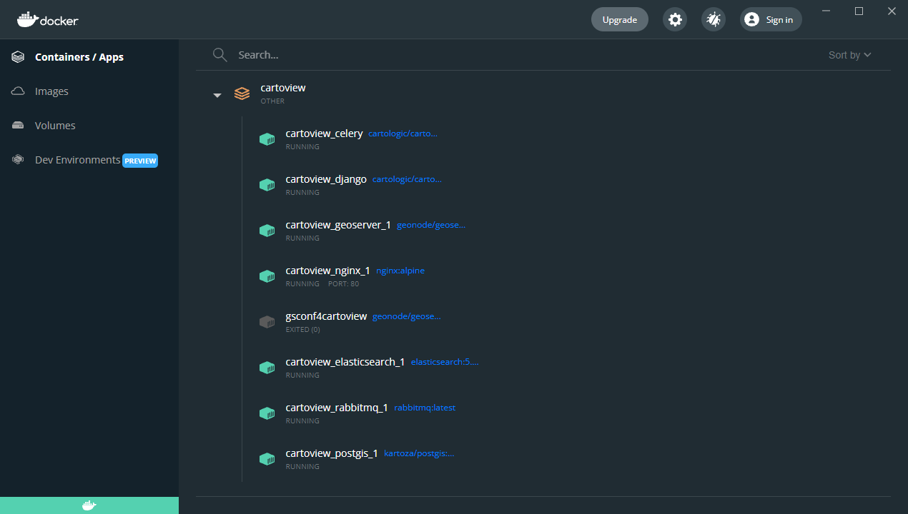

Also, you can see the logs by just ``double-click`` on ``cartoview``.

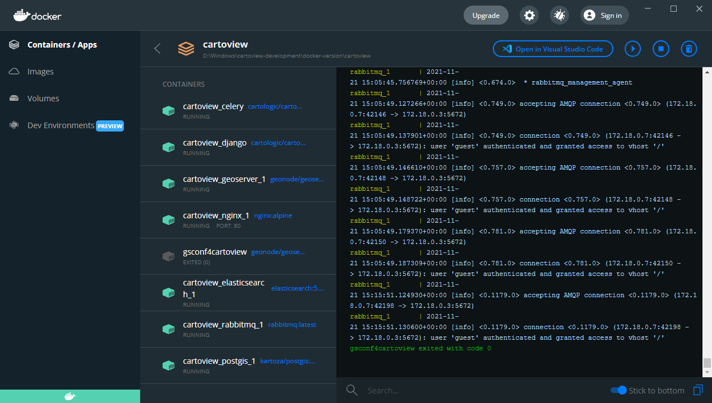

- **Migrate & Load default data**

*** 

We need to execute some commands to the service after it's up and running. So we will open the terminal inside ``Cartoview`` container.

**For Ubuntu:**

```shell
docker exec -it cartoview_cartoview_1 /bin/bash
```

**For Windows:**

Open **Docker Dashboard** and for ``cartoview_cartoview_1`` container, click on the Cli button to open the terminal in which we will execute the below commands.

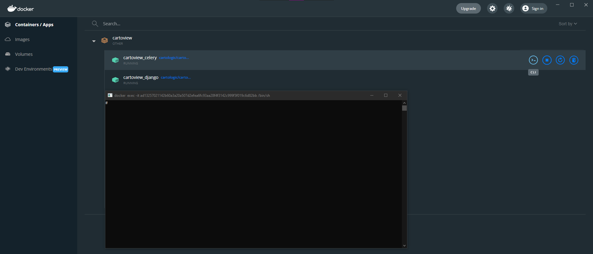

This will open a shell inside the container in which we will execute the following commands.

Detect changes in the ``app_manager``.
```shell
python manage.py makemigrations app_manager
```

Migrate the data.
```shell
python manage.py makemigrations
python manage.py migrate
```

Create accounts table.
```shell
python manage.py migrate account
```

Load default User.
```shell
python manage.py loaddata sample_admin.json
```

Load default oauth apps so that you will be able to authenticate with defined external server.
```shell
python manage.py loaddata default_oauth_apps.json
```

Load default Initial Data for Cartoivew.
```shell
python manage.py loaddata initial_data.json
```

Load default Cartoview Appstore data.
```shell
python manage.py loaddata app_stores.json
```

!!! note
    After executing the above commands, you can ``exit`` the container terminal by just typing exit then hit the ``Enter`` button.
    
Restart the services running on docker so that the changes takes effect.

```shell
docker-compose restart
```

- **Test the development server**

***

In the browser navigate to ``localhost:80``. 

**For Windows:**

Open Docker Dashboard and for ``cartoview_nginx_1``container, click on ``Open in browser`` button to open Cartoview in the browser.

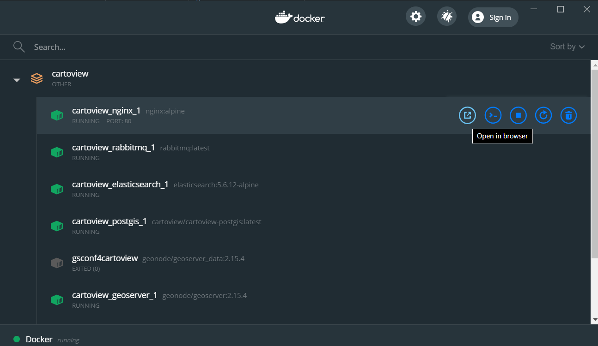

You should get:


**Sign-in with:**
```shell
user: admin
password: admin
```

**For GeoServer:**
Open ``localhost:80/geoserver``


**Sign-in with:**
```shell
user: admin
password: geoserver
```

## GeoServer Configuration

- **Optional | Change default GeoServer admin Password**

***

1. Login with GeoServer credentials that were mentioned above.

2. At the left-side menu, navigate to **Security** section and click on **Users, Groups, Rules**.

    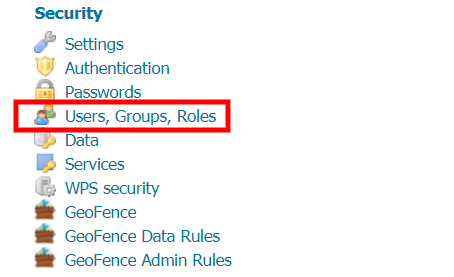

3. Click on **Users/Groups** then select **admin**.

    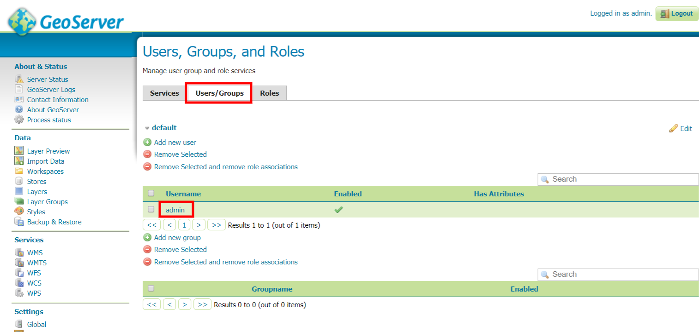
    
4. Set the password you wish then scroll to the end of the page and click **Save**.

    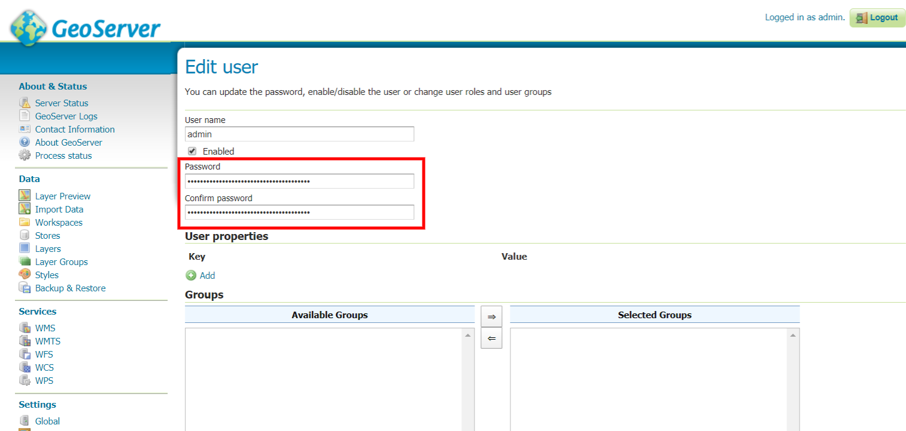
    
Now, you can logout and login again with the new password you have just entered.

- **Configure GeoServer with Cartoview**

***

In order for Cartoview to work properly, we need to authenticate GeoServer with it.

1. Inside ``cartoview`` directory, navigate to ``env`` folder and open the file called **celery.env**.

    Edit the contents of the file as below:
    
    ``GEOSERVER_PUBLIC_LOCATION=http://localhost/geoserver/ instead of http://10.5.0.4/geoserver/.``
    ``SITEURL=http://localhost/ instead of http://10.5.0.4/.``
    
2. Repeat step 1, but for another file which is **django.env**.

3. For GeoServer, at the left-side menu, navigate to **Security** section and click on **Authentication**.

    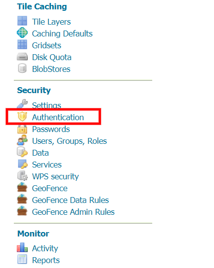
    
    At the Authentication Filters, select **geonode-oauth2**.
    
    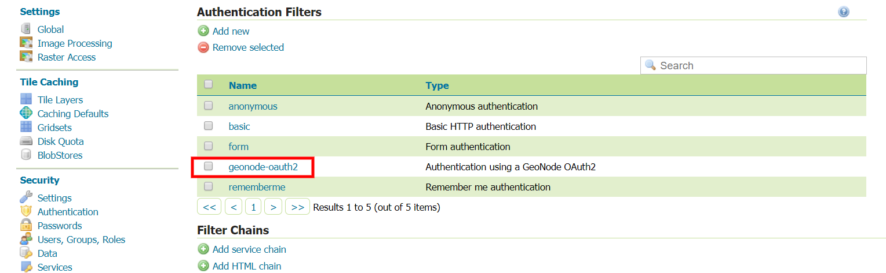
    
    Change the URLs inside the red square to the values in the image then click **Save**.
    
    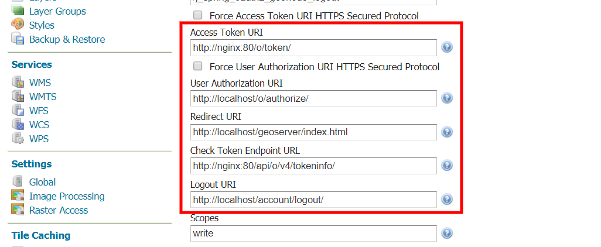
    
4. At the left-side menu, navigate to **Security** section and click on **Users, Groups, Rules**.

    Click on **geonode REST role service**. 
    
    Select **ROLE_ADMIN** for **Administrator role** and **Group administrator role**.
    
    Edit the **Base Server URL**
    
    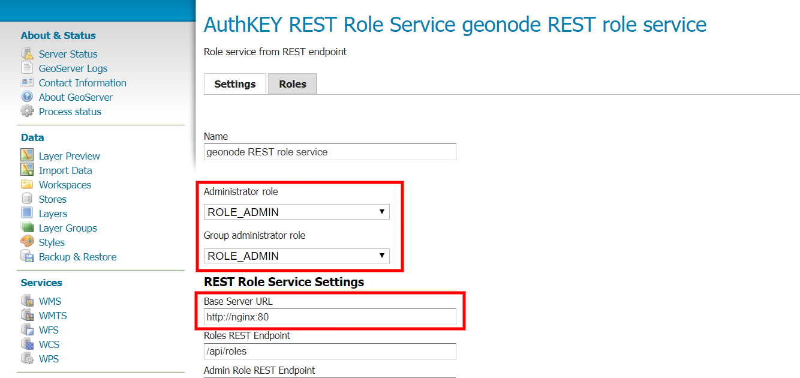
    
5. At the left-side menu, navigate to **Settings** section and click on **Global**.

    Edit the **Proxy Base URL**.

    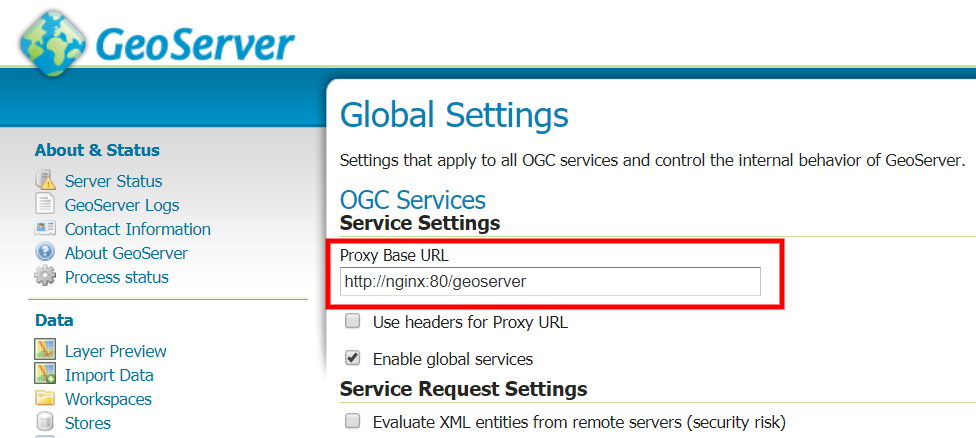

6. Add **GeoServer OAuth2 Redirect URIs** accordingly.

    Open ``Cartoview Admin Dashboard`` in the browser at ``localhost/admin``.
    
    Navigate to this directory, ``Home › Django OAuth Toolkit › Applications › GeoServer``.
    
    Make sure GeoServer URLs are like the image below then click **Save**.
    
    

**Verify the process of authentication between GeoServer and Cartoview**

Sign out from GeoServer and navigate to Cartoview at ``localhost``.

Login in Cartoview with the credentials:
```shell
user: admin
password: admin
```

Open GeoServer from the **admin dropdown**.


You should find that GeoServer user is logged in automatically, and the authentication process runs properly.
