# Cartoview Installation | Windows

## Introduction
This document describes the installation of Cartoview with GeoNode 2.10.3 on Windows 10.

## Installation Requirements
- **Install Python2.7**
***

Download [Python Windows installer][1] and proceed with installation.

[1]: https://www.python.org/ftp/python/2.7.17/python-2.7.17.amd64.msi

While installing python, we need to add it to the path so that we can use it inside the command prompt.

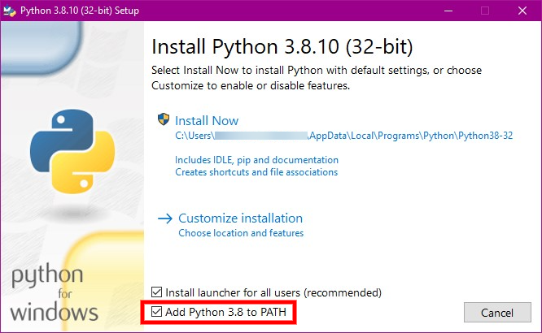

Then click ``Next`` then ``Finish`` to complete the installation.

- **Install Virtualenv & Create a Python Virtual Environment**
***

Create a folder in the directory at which you want to install Cartoview and Let's name it ``cartoview_service`` (You can name it whatever you want).

Inside ``cartoview_service`` folder, ``right-click with left-Shift`` on the free space and select ``Open PowerShell window here``.


This will open a terminal in which we will execute all the upcoming commands. Just copy-paste the commands and hit the ``Enter`` button.

Check whether virtualenv is installed or not.
```shell
virtualenv --version
# virtualenv 20.0.15 from c:\python27\lib\site-packages\virtualenv\__init__.pyc
```

If it's not installed, do:
```shell
pip install virtualenv
```

Create a virtual environment and call it ``cartoview_venv``.
```shell
virtualenv cartoview_venv
```

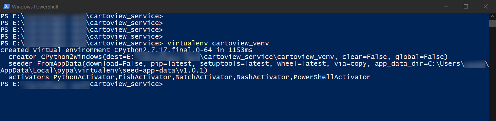

!!! note
    You can name it whatever you prefer, but bare in mind to change every ``cartoview_venv`` in the commands below with the name you want for your virtual environment.
    
Now after creating the virtual environment, we need to activate so that we will be able to use it.
```shell
.\cartoview_venv\Scripts\activate
```

!!! note
    - If you are having an issue executing the above command, specifically if you got this ``error cannot be loaded because the execution of scripts is disabled on this system``. Close current powershell session and open another but with the "Run as Administrator" option (You can search for the powershell inside the search bar then right-click on it and select ``Run as Administrator``).
    
    Inside the terminal session, execute this:
    ```
    .\cartoview_venv\Scripts\activate
    ```
    
    - This will allow running unsigned scripts that you write on your local computer and signed scripts from Internet. Now, you can try activating the virtual environment again.
    
    - You would notice how your prompt is now prefixed with the name of the virtual environment, ``cartoview_venv`` in our case.
    
- **Install the following required packages**
***

!!! note
    From now on, each command must be executed inside the PowerShell while the virtual environment is activated.

```shell
pip install django==1.11.11 GDAL==2.2.4 Shapely==1.6.4.post2 Pillow==6.2.2 libxml2-python==2.9.3 pytz==2019.3
```

If you got errors while installing the above packages, you can download the wheel files of the packages that cause these errors from [The Unofficial Windows Binaries for Python Packages][2].

[2]: https://www.lfd.uci.edu/~gohlke/pythonlibs/
    
For example, to install **GDAL 2.2.4**:

1. Download the wheel file of GDAL 2.2.4 that is compatible with Python    2.7 from the above link. You should get a file called, ``GDAL-2.2.4-    cp27-cp27m-win_amd64.whl``.
2. While having the virtual environment ``cartoview_venv`` activated, navigate to the downloads folder (or the folder in which you have downloaded the wheel file), execute the following.

```shell
cd C:\Users\your_user\Downloads
pip install GDAL-2.2.4-cp27-cp27m-win_amd64.whl
```

## Database Installation

- **Download and Install PostgreSQL**

***

Download PostgreSQL installer certified by EnterpriseDB from [here][3]. We will use version **10.12**.

[3]: https://www.enterprisedb.com/downloads/postgres-postgresql-downloads

&nbsp;&nbsp;&nbsp;&nbsp;1. Open the downloaded exe and proceed with the installation.

&nbsp;&nbsp;&nbsp;&nbsp;2. Change the Installation directory if required, else leave it as default.

&nbsp;&nbsp;&nbsp;&nbsp;3. You can choose the components that you want to be installed in your system. We will leave it as default.
&nbsp;&nbsp;&nbsp;&nbsp;

!!! note
    This will install ``pgAdmin4`` which is a management tool for PostgreSQL database.

&nbsp;&nbsp;&nbsp;&nbsp;4. Leave the data location as default.

&nbsp;&nbsp;&nbsp;&nbsp;5. Enter a super user password. This is the one by which you will access all your databases including what we will create next, so remember it.
&nbsp;&nbsp;&nbsp;&nbsp;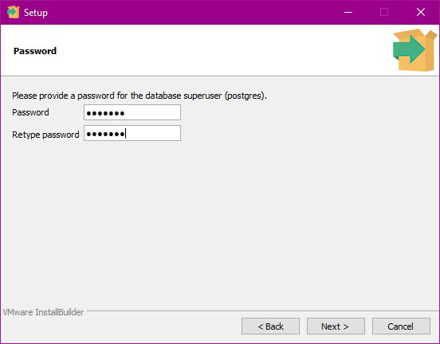

&nbsp;&nbsp;&nbsp;&nbsp;6. Leave the port number ``5432`` as default.

&nbsp;&nbsp;&nbsp;&nbsp;7. Click ``Next`` to start the installation.

&nbsp;&nbsp;&nbsp;&nbsp;8. Before click on ``Finish``, make sure to leave the check on for the stack builder to start it after finishing.

&nbsp;&nbsp;&nbsp;&nbsp;9. Select ``PostgreSQL 10 (X64) on port 5432``.
&nbsp;&nbsp;&nbsp;&nbsp;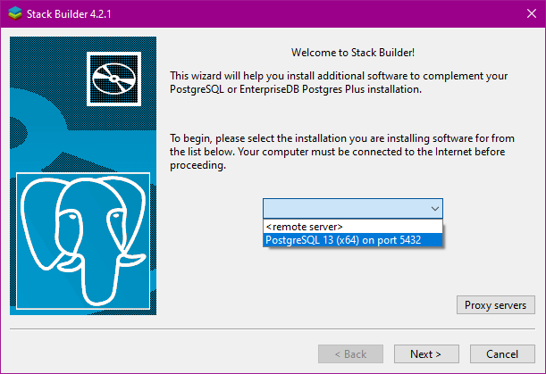

&nbsp;&nbsp;&nbsp;&nbsp;10. Install PostGIS 2.4 and select ``Next`` to download all the required files.
&nbsp;&nbsp;&nbsp;&nbsp;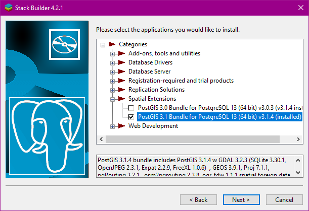

&nbsp;&nbsp;&nbsp;&nbsp;11. Select PostGIS. Click Ok for any prompt appears.
&nbsp;&nbsp;&nbsp;&nbsp;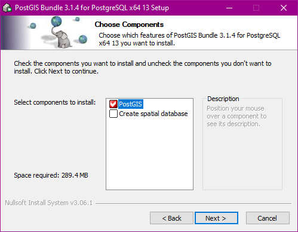

Now the installation of PostgreSQL database is completed successfully.

- **Acess pgAdmin4**

***

In the search bar (beside windows icon), search for ``pgAdmin4`` application and run it.

If you click on PostgreSQL under Servers panel, you will be prompted to enter the password that you set during the installation.
&nbsp;&nbsp;&nbsp;&nbsp;

You will should get pgAdmin4 dashboard.
&nbsp;&nbsp;&nbsp;&nbsp;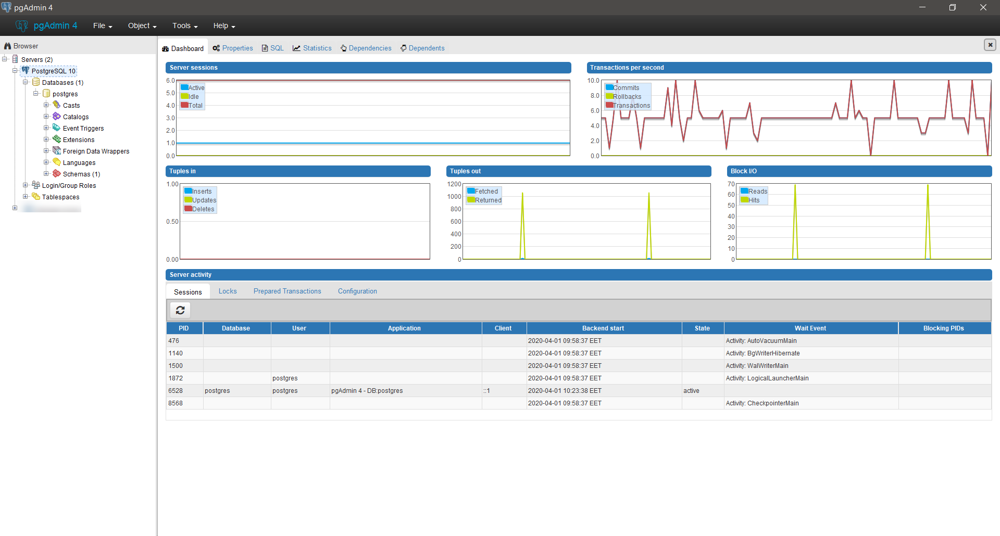

!!! note
    You may notice that there's a created databse already called ``postgres`` that will be used to create Cartoview databases.
    
## Database Configuration

- **Create Cartoview databases using pgAdmin**

***

Now we will create Cartoview databases. Particularly, ``cartoview`` and ``cartoview_datastore``.

&nbsp;&nbsp;&nbsp;&nbsp;1. Under PostgreSQL 10 tree, right click and select ``Create`` >> ``Database``.
&nbsp;&nbsp;&nbsp;&nbsp;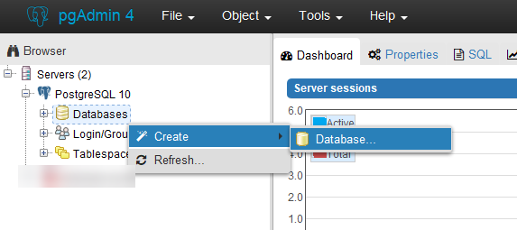

&nbsp;&nbsp;&nbsp;&nbsp;2. You will be prompted a pop-up to enter information about the database like the database name and template. Set the fields as in the images below.
&nbsp;&nbsp;&nbsp;&nbsp;
&nbsp;&nbsp;&nbsp;&nbsp;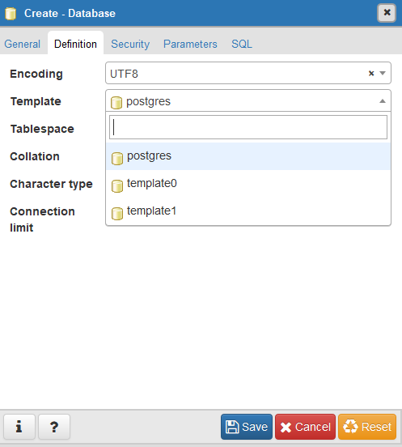

&nbsp;&nbsp;&nbsp;&nbsp;3. After creating the database, add ``postgis`` extension to it.
&nbsp;&nbsp;&nbsp;&nbsp;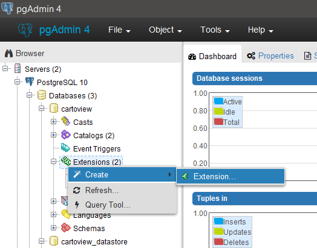

In the Name field, search for ``postgis`` and select it. Then click ``Save``.
&nbsp;&nbsp;&nbsp;&nbsp;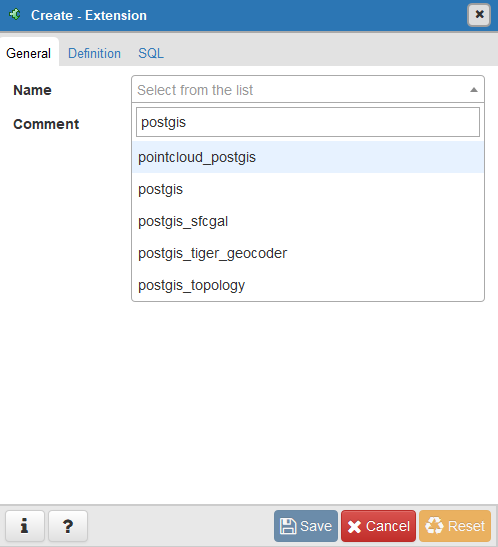

!!! note
    For **step 3**, if you got the following error when you click save after selecting ``postgis`` extension.
    ``ERROR: could not load library "C:/Program Files/PostgreSQL/10/lib/rtpostgis-2.4.dll": %1 is not a valid Win32 application.``
    
    Navigate to this path: ``C:\Program Files\PostgreSQL\10\bin\postgisgui`` in PostgreSQL installation directory and copy these files, ``libeay32.dll`` and ``ssleay32.dll`` to the bin path, ``C:\Program Files\PostgreSQL\10\bin`` and try to save again.

&nbsp;&nbsp;&nbsp;&nbsp;4. Repeat the steps from 1 to 3 to create the second database, ``cartoview_datastore``.

!!! warning
    When repeating the steps to create the second database, don't forget to name the database in step 2 to be ``cartoview_datastore``.
    
## GeoNode 2.10.3 Installation

Follow these steps if you don't have GeoNode 2.10.3 installed on your Windows 10 machine.

- **Install GeoNode 2.10.3**

***

!!! note
    Make sure you're inside ``cartoview_service`` directory and the ``cartoview_venv`` is still activated.
    
Download [GeoNode 2.10.3][4].

[4]: https://github.com/GeoNode/geonode/archive/2.10.3.zip

Extract it in the directory of ``cartoview_service`` folder. This will make a folder called ``geonode-2.10.3`` that contains GeoNode instance.

Now we need to navigate inside ``geonode-2.10.3`` folder and install the packages from ``requirements.txt`` file.

```shell
cd geonode-2.10.3
pip install -r requirements.txt --no-deps
```

Finally, install geonode from the current directory using the following command.

```shell
pip install -e .
```

!!! warning
    Make sure you got the dot ``.`` when you copy the previous command.
    
## Cartoview Libraries Installation 

!!! warning
    Make sure you're inside ``cartoview_service`` directory and the ``cartoview_venv`` is still activated.

- **Download and install Cartoview**

***

Download the latest version of cartoview by cloning the repository.

```shell
git clone https://github.com/cartologic/cartoview.git
```

This will create a directory called ``cartoview`` inside ``cartoview_service`` directory.

Now we need to install cartoview dependencies, but first go to ``cartoview`` directory.

```shell
cd cartoview
pip install -e .
```

!!! warning
    Make sure you got the dot ``.`` when you copy the previous command.
    
- **Make sure the created databases are in the ``settings.py`` file**

***

Go to ``cartoview`` directory, you will find inside it another folder called ``cartoview``. Navigate inside it.

You should find a file called ``local_settings.py.sample``. Remove the last word ``sample``.

This will override the ``settings.py`` file with a configured another settings file which is ``local_settings.py``.

If you open ``local_settings.py``, you will find the databases that we have created above:

```
DATABASES = {
  'default': {
      'ENGINE': 'django.contrib.gis.db.backends.postgis',
      'NAME': 'cartoview',
      'USER': 'postgres',
      'PASSWORD': 'cartoview',
      'HOST': 'localhost',
      'PORT': '5432',
  },
  # vector datastore for uploads
  'datastore': {
      'ENGINE': 'django.contrib.gis.db.backends.postgis’,
      'NAME': 'cartoview_datastore',
      'USER': 'postgres',
      'PASSWORD': 'cartoview',
      'HOST': 'localhost',
      'PORT': '5432',
  }
}
```

!!! note
    If you want to override any variable settings (for example to change the database password ,name or host), you can do this inside ``local_settings.py`` to override the settings in ``settings.py``.
    
- **Create a symbolic link of OSGeo into ``cartoview_venv`` needed by GDAL to run properly**

***

Add the following lines inside ``local_settings.py``, replacing ``your_path`` with the complete path to ``cartoview_service`` folder.

```
os.environ['Path'] = r'your_path\cartoview_service\cartoview_venv\Lib\site-packages\osgeo;' + os.environ['Path']
os.environ['GEOS_LIBRARY_PATH'] = r'your_path\cartoview_service\cartoview_venv\Lib\site-packages\osgeo\geos_c.dll'
os.environ['GDAL_LIBRARY_PATH'] = r'your_path\cartoview_service\cartoview_venv\Lib\site-packages\osgeo\gdal202.dll'
```

- **Migrate & Load default data**

***

Inside ``cartoview`` folder, run the below commands to migrate and load Cartoview data.

!!! note
    Make sure the virtual environment is still activated (If you see its name prefixed your prompt, you're good to go).

Detect changes in the ``app_manager``.
```shell
python manage.py makemigrations app_manager
```

Migrate the data.
```shell
python manage.py makemigrations
python manage.py migrate
```

Create accounts table.
```shell
python manage.py migrate account
```

Load default User.
```shell
python manage.py loaddata sample_admin.json
```

Load default oauth apps so that you will be able to authenticate with defined external server.
```shell
python manage.py loaddata default_oauth_apps.json
```

Load default Initial Data for Cartoivew.
```shell
python manage.py loaddata initial_data.json
```

Load default Cartoview Appstore data.
```shell
python manage.py loaddata app_stores.json
```

- **Test Development Server by running this Command**
```shell
python manage.py runserver 0.0.0.0:8000
```

At ``localhost:8000``, you should get:

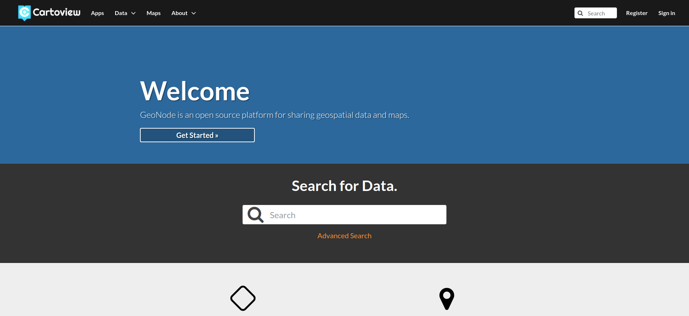

**Sign-in with:**
```shell
user: admin
password: admin
```

Now we have Cartoview up and running, last thing we need to do, is to install and configure GeoServer to run with it.

## GeoServer 2.16.2 Installation

- **Install JRE**

***

Make sure you have a Java Runtime Environment (JRE) installed on your system. GeoServer requires a Java 8 environment. The Oracle JRE is preferred, but OpenJDK has been known to work adequately. You can download [JRE 8 from Oracle][5].

[5]: https://www.oracle.com/java/technologies/javase-jre8-downloads.html

- **Install Apache Tomcat 9**

***

Download the windows installer from [here][6].

[6]: https://downloads.apache.org/tomcat/tomcat-9/v9.0.33/bin/apache-tomcat-9.0.33.exe

While proceeding with the installer, make sure to check installing ``Host Manager``.
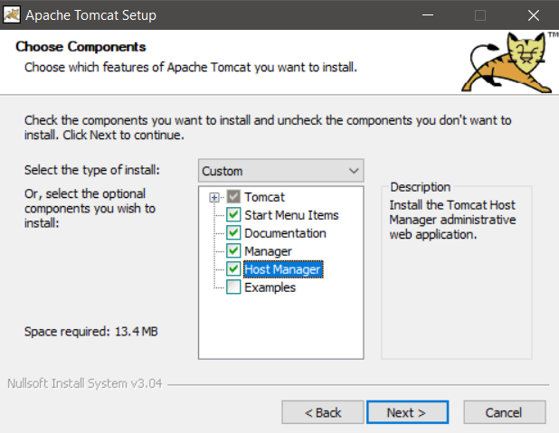

Configure Tomcat Web Management Interface by setting the admin credentials. We will set username to be ``admin`` and password to be ``cartoview``.
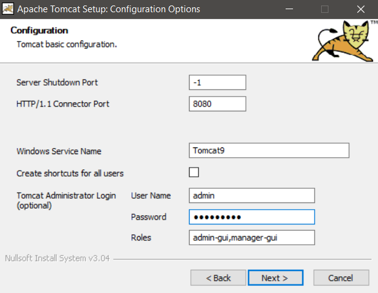

!!! note
    Make sure the Roles field contains ``admin-gui``, ``manager-gui``.
    
Proceed with the installation untill you have Tomcat 9 up and running and you can check it in Windows Services.

- **Download and install GeoServer war file**

***

Now we will download the latest stable version of GeoServer war file from [here][7].

[7]: https://build.geo-solutions.it/geonode/geoserver/latest/geoserver-2.16.2.war

You should get a war file called ``geoserver-2.16.2.war``. For sake of simplicity, we will rename it to be ``geoserver.war`` instead of the previous.

Copy the file and navigate to Tomcat installation directory and paste the war file inside ``webapps`` folder.

!!! note
    Usually, Tomcat directory is at this path ``C:\Program Files\Apache Software Foundation\Tomcat 9.0``.
    
In the search bar (beside windows icon), search for Services and run it. It should open to you all the running services on your windows machine.

Navigate to a service called `Apache Tomcat 9.0` and restart it.

This will cause Tomcat to serve GeoServer from the war file which we have put inside ``Tomcat 9.0/webapps``.

!!! note
    Make sure that GeoServer is running:
    
    - Navigate to ``localhost:8080`` to open Tomcat then click on Manager App.
    
    - Login with the credentials, you have entered during Tomcat installation.
    
    - You should find GeoServer under Applications section started already.


    
Now GeoServer is up and running at ``localhost:8080/geoserver``.

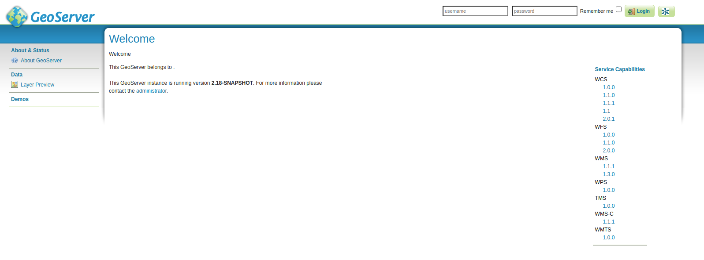
**Sign-in with:**
```shell
user: admin
password: geoserver
```
