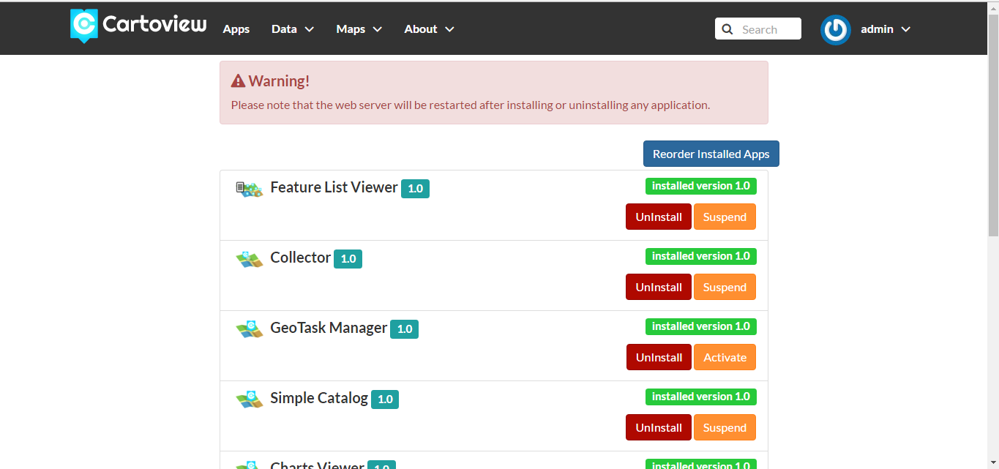
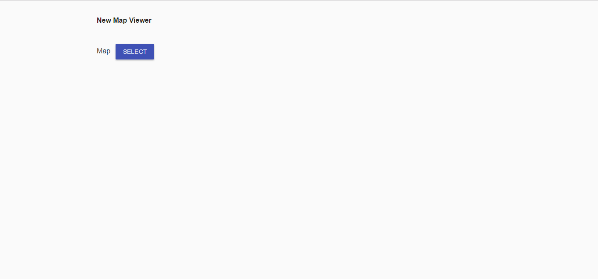
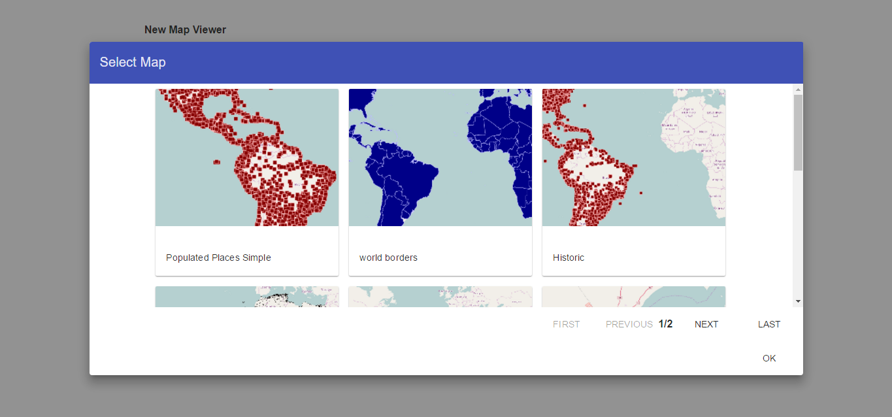
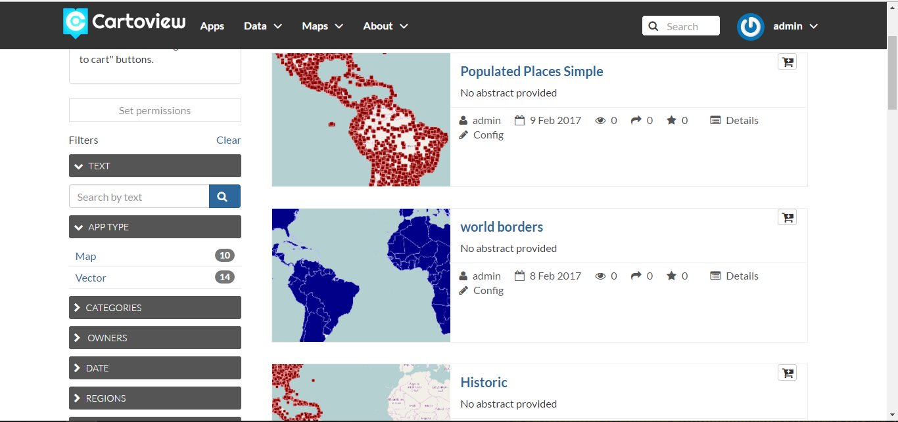
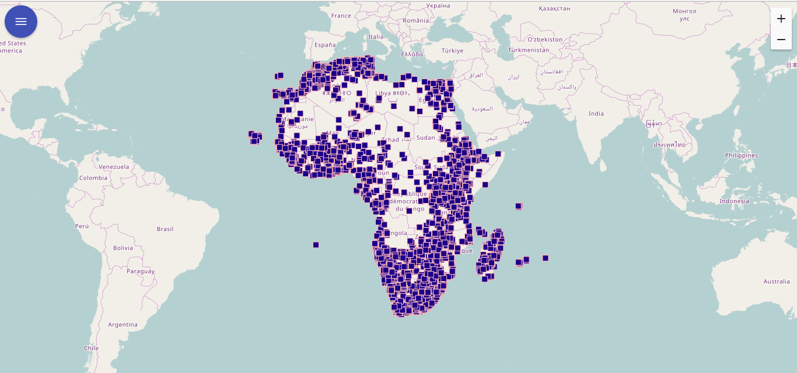

##What is Cartoview

Cartoview is a web platform which enables the rapid deployment of easy-to-manage and easy-to-use Web Mapping Applications. It is an expansion of the well-known GeoNode platform and it’s all about installing, authoring and utilizing Web Mapping Applications within this platform. It integrates with the GeoNode Project to extend the platform and provide users with the experience of using Web Mapping Applications along with their Layers, Maps and Documents. It makes extensive use of the infrastructure, security and management tools of GeoNode in order to solve user problems and challenges. It enables user to apply workflows on data management and maintenance of their content (e.g. layers, maps and documents). It offers functionality to install, uninstall, author and manage Web Mapping Apps. Furthermore, it enables user to create App instances for specific business requirements utilizing the layers, maps, documents, users and groups which are available within the framework of GeoNode.

##Where to find Cartoview apps
A number of Cartoview Apps has been developed by Cartologic and are freely available for download at [Cartoview App Center][1]. However if you are a developer and you are interested in joining this effort, feel free to download and install Cartoview from here and start developing your own apps. We even encourage you to submit your Apps at Cartologic and after a review process, code cleaning and approval they will be available to the community.

##Cartoview Apps Panel
Click on the **Apps link** to launch the Cartoview Apps Panel. This is the home page of Cartoview. From here you can launch the installed apps, install new apps, create app instances, manage the apps etc.

> **Note**:
>> It is required to sign in with an administrator account in order to perform Cartoview Apps management tasks.

##Cartoview Apps Manager
Click on the **Manage Apps button** in the upper right corner of the page. This will launch the Cartoview Apps Manager where you can install new apps, uninstall or suspend existing.

[1]: http://cartoview.org

##Cartoview Apps Installation
It's Simple beside the App you want to install click **install Button** Then Wait untill server restart the App will appear in [Apps Panel](manager.md#cartoview-apps-panel)

##Create new App Instance
To Create new App Instance in [Apps Panel](manager.md#cartoview-apps-panel) find your App and click **create new Button** , Configration Page Will Open

##Explore App Instances
In [Apps Panel](manager.md#cartoview-apps-panel) Find App you want and Click Explore . A list of the App instances created based on this App will appear. Click on any instance to launch the “App Instance Explorer” page.

Make use of the available functionality, like zooming, panning, identifying or searching for specific geographical feature or location.

