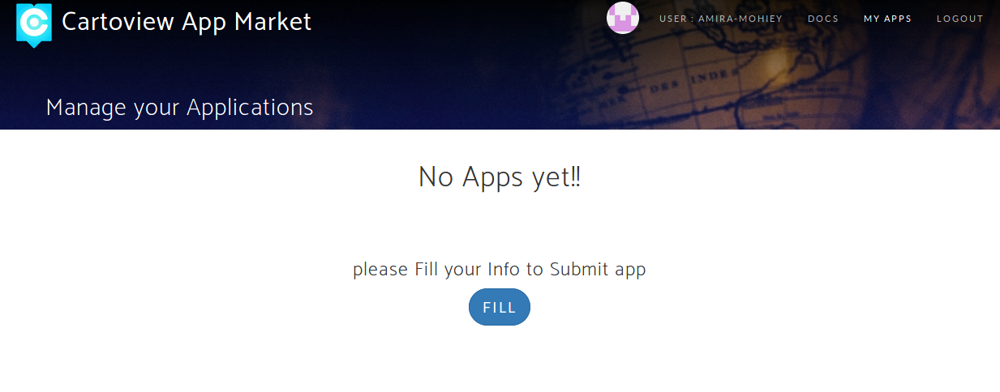
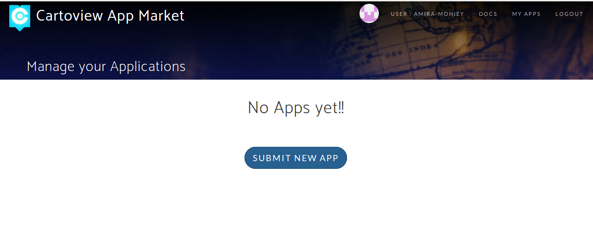
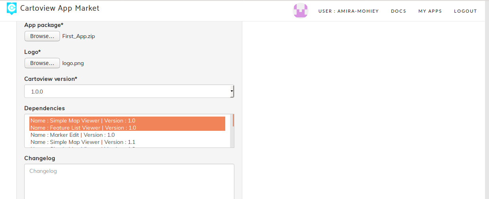
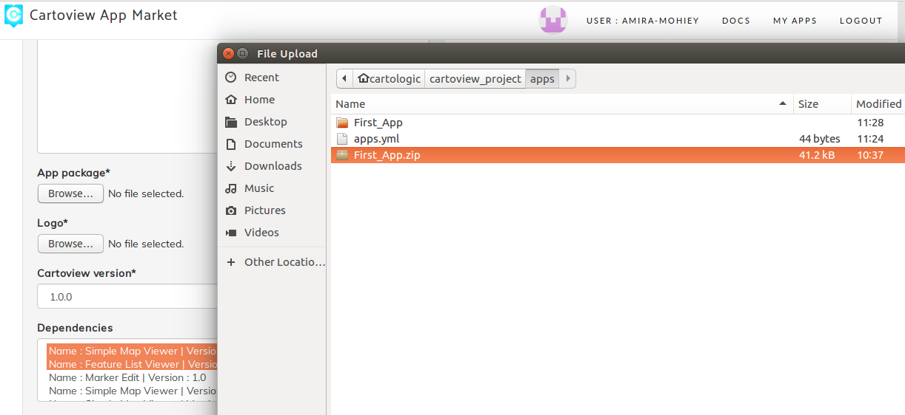
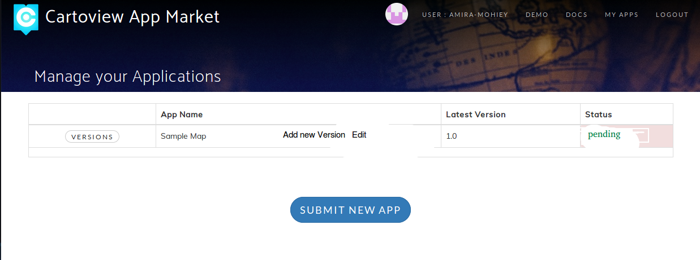
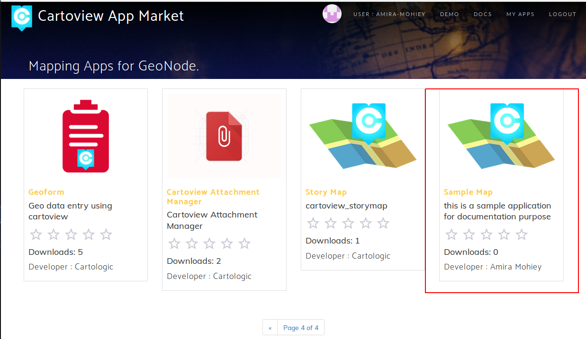

# Upload App to Cartoview GeoApp Market

After creating your app as mentioned at [developers section](/for-developers), you can upload your app to [Carotview App Market][1] to be shared with Cartoview community and make the best use of features provided by Cartoview. 

Do the following shown steps to upload your app to Cartoview App market.

[1]: https://cartoview.net/

1. Visit [Cartoview App Market][1]

    

2. Login with your Google, Twitter or Github account.

    
    
3. After login you will need to fill your info to submit apps.

    
    
    
4. Now you can submit apps.

    
    
5. Fill the information about your app.

    
    
    
    !!! note
        You need to upload the app package as a zipped folder.
        
        

6. After submitting your app, it will need an approval. After it's approved, the status will change to be ``approved``.

    
    
7. After approval you will find your app on Cartoview App Market.

    
    