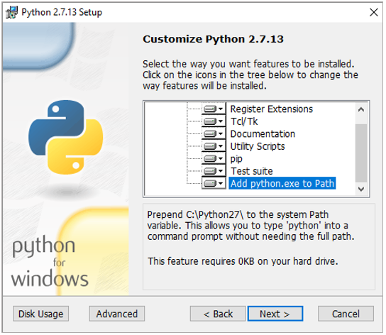

#Cartoview

##Docker

##Installation Requirements

- Install [Python2.7](https://www.python.org/download/releases/2.7/)
	- Make Sure to add Python to the Path, as this is not done by default 
    
	- Add python.exe to the PATH
    <br/> <br/>
		
        
        
		<br/>
        
- Install Django 1.8.7 
     , Open Command Prompt then type:

	```sh
	pip install django==1.8.7
	```
    
!!! attention "Docker Users"
    - You need to install [docker-compose](https://docs.docker.com/compose/install/)

- For Windows Users install ```make``` by
	- Installing [MSYS2](http://www.msys2.org/)
	- Open MSYS2 shell and Install ```make``` using this command ```pacman -S make```
	- Add ```<msys_path>\usr\bin``` to ```PATH``` envirnment variable
-  Use ```Docker Quickstart Terminal``` to execute the following commands
    - Create Cartoview Project which contains required files to run and configure Docker using this command:

        ``` python
        django-admin.py startproject --template=https://github.com/cartologic/cartoview-project-template/archive/master.zip --name django.env,uwsgi.ini,.bowerrc,server.py <your_project_name>
        ```

    - Replace ```<your_project_name>``` with the desired name

    - Go to your project Folder

         ``` python
         cd <your_project_name>
         ```

    - Open ```docker-compose.yml``` and Look at port numbers for GeoServer and PostGIS and change the number before the ```:``` this will be the port on your machine

	!!! tip "Tips"
			- Any file with ```.env``` EXTENSION is a file that contains Environment Variables passed to specific container for example ```django.env``` file contains Environment Variables passed to CartoView container so Django can read these variables and use them
			- Default database username: ```cartologic``` and password: ```root```
			- Default database username is in ```postgis.env``` file in your project if you want to change it.
			- If you want to run this project with a domain :
				- From```django.env```(this is a file that contain common django setting variables) file in your Project Folder:
					``` python
					DATABASE_URL=postgres://<database_user_name>:<database_password>@postgis:5432/cartoview
					GEOSERVER_PUBLIC_LOCATION=http://<your_domain_or_ip>/geoserver/
					GEOSERVER_LOCATION=http://geoserver:8080/geoserver/
					SITEURL=http://<your_domain_or_ip>
					ALLOWED_HOSTS=['*']
					```
			- For windows users the default IP aasigned to Docker is : ```192.168.99.100``` so the default django.env file must be something like this:
				``` python
				DATABASE_URL=postgres://<database_user_name>:<database_password>@postgis:5432/cartoview
				GEOSERVER_PUBLIC_LOCATION=http://192.168.99.100/geoserver/
				GEOSERVER_LOCATION=http://geoserver:8080/geoserver/
				SITEURL=http://192.168.99.100
				ALLOWED_HOSTS=['*']
				```

	!!! warning
		- For windows Users Please Comment volumes lines of postgis Container only in ```docker-compose.yml``` by preceding the line with ```#``` something like this:
			```python
				#   volumes:
				#    - pgdata:/var/lib/postgresql
			```
		- if ```django-admin.py``` not working try ```django-admin```


- Start Docker Images(CartoView,GeoServer,Postgres) type :

	``` sh
	make run
	```


	!!! success "Success"
		Now you can Access cartoview on ```http://localhost``` or ```http://<your_domain_or_ip>```
	!!! warning "Important"
		Final step Configure GeoServer before uploading layers from [Here](http://docs.geonode.org/en/master/tutorials/admin/geoserver_geonode_security/#geoserver-security-backend)

##Deployment notes

- !!! warning "Important"
	Once CartoView is installed it is expected to install all the Apps from the app store automatically
	CartoView will not be able to restart Docker when new apps install.
	After you install any new app or any app update you will need to restart docker manually until this issue is addressed in the future
	- Follow these steps to get Apps working on nginx
		- Collect static files using this commands in your project folder
			``` sh
			make collect_static
			```
		- Restart server now with the following command you should restart server after installing any App
			``` sh
			docker-compose restart cartoview
			```
## Windows Issues
- Docker volumes have some issues with windows so you have to backup your postgres database.

## Docker on Linux
- You will Find all postgres data in pgdata folder.


